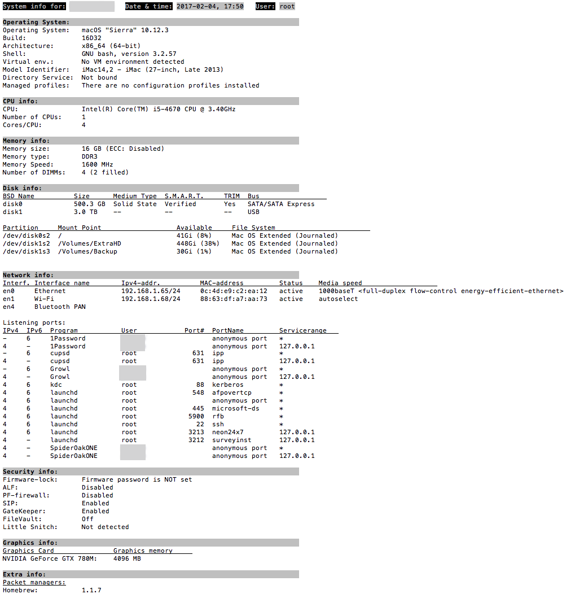
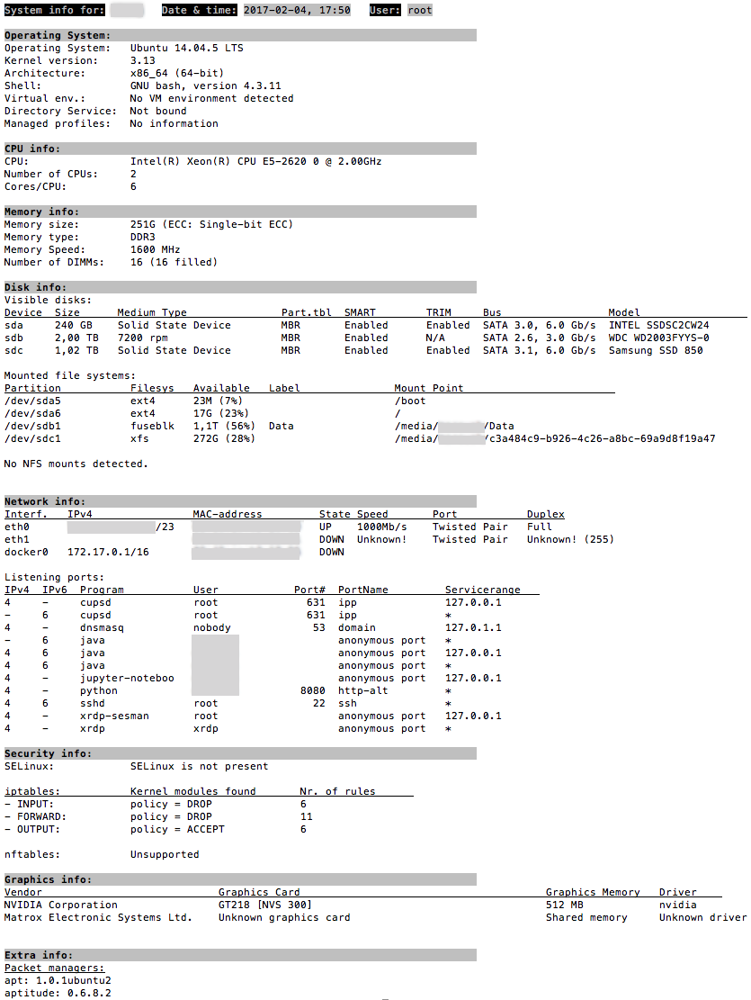

# system-info
A bash-script that answers the question: “where have I landed” when you as a sysadmin log in to a new computer!

The script presents basic information of the OS you are running. (A full report of everything is *not* the intention)

Main targets: OS X and Linux. It would be nice to cover other Unix systems, but that comes later.

The following information is presented:

* OS Release
* OS architecture & bit count
* Virtual environment (if any)
* Connection to Active Directory or LDAP
* If the computer is managed by any of the major management tools
* CPU
* Memory
* Disk info
* Network info
* Security information
* Graphics info
* Extra information (listing package managers and logged in users)

Tested Distributions:

* OS X: 10.10, 10.11, 10.12
* Linux: CentOS 6 & 7; Ubuntu 14 & 16; Mageia 5; Debian 8; Arch Linux

-----

**Options:**

* `-i` gives you information about commands that will allow you to dig deeper yourself :-)

-----

**Requirements:**

* Generally, the script is written using only standard bash tools available on both macOS and Linux
* However, on Linux, `dmidecode` (http://savannah.nongnu.org/projects/dmidecode/) is used for many things. If you don't have it your distro, memory reporting will be omitted [on Linux]. Also, `smartctl`is used to detect SMART-information and `hdparm` for TRIM status
* If you are not running the script as `root`, the following information will be detected:  
	* (Linux): some details about virtual environment (i.e. `dmidecode`)
	* (Linux): memory type, speed and number of DIMMs (i.e. `dmidecode`)
	* (macOS): presence of firmware password
	* (macOS): status of the packetfiler firewall
	* (macOS): whether Profiles are enabled of not
	* (both): open LISTEN-ports belonging to processer other than your own

-----

Screen shot for macOS:  

-----

Screen shot for Linux:  

